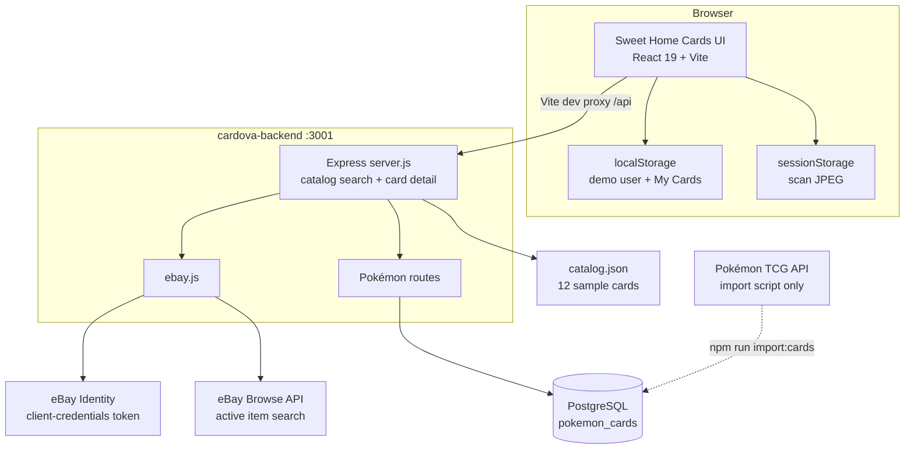
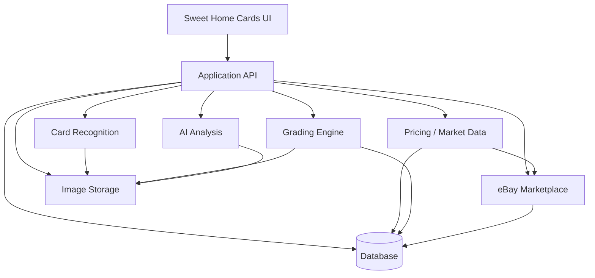

# Sweet Home Cards — Technical Audit

Audit date: 2026-09-23. This document describes the repository as it existed at the audit. It does not propose a new schema.

Foundation Milestone 1 changed card identity and market-data handling after this audit. Where the two disagree, [docs/FOUNDATION_MILESTONE_1.md](FOUNDATION_MILESTONE_1.md) is the current description. In particular, `expandCard` / `NUMERIC_GRADES` are gone, search and card detail use one normalized card, and the eBay strip requests listings once.

The product name in the UI is **Sweet Home Cards** (`cardova/index.html` title and the home-page footer). The header logo alt text says **Sweet Home Sports Cards**. The repository and npm packages are named **Cardova**. Browser storage keys use the prefix `shc-`.

---

# 1. Executive Summary

Sweet Home Cards is a local web app for looking up a small set of trading cards, seeing sample grade prices, and opening live eBay listings that are currently for sale. A camera screen can take a photo, then the user types a name and the app searches the same sample catalog. A demo login on the device can save cards into “My Cards.” A separate backend can import the Pokémon TCG catalog into PostgreSQL, but the website does not call that API.

## Main user flows

1. **Search.** Home or the search page accepts a text query. The browser calls `GET /api/cards`. Results come from `cardova-backend/catalog.json` (12 cards). Opening a result loads `GET /api/cards/:id`.
2. **Card detail.** The page shows the name, number, set, and variant, a row of grade prices, a sample “sales” table for the selected grade, and a horizontal strip of live eBay listings from `GET /api/cards/:id/listings`.
3. **Scan.** `/scan` opens the device camera, captures one JPEG, stores it in `sessionStorage`, and asks the user to type a player or card name. That text is sent to the normal search page. The photo is shown as a banner. It is not identified.
4. **My Cards.** Login stores a display name in `localStorage`. Saved cards are also stored in `localStorage` on that browser. Search, scan, and card detail work without logging in.

## What appears complete

- The search → results → card detail path for the 12-card sample catalog, including sort, set filter, sports-only filter, and a variations toggle.
- Live **active** eBay listing lookup for a catalog card, using the eBay Browse API and an application access token, with a short in-memory cache and a clear “for sale, not sold” label.
- Camera capture with a card-shaped guide, optional torch, and a stored preview photo.
- Demo login, header, mobile menu, and a device-local saved-card list.
- A typed Pokémon import pipeline: migration, paginated TCG API client with retries, mapper, repository, and read-only HTTP routes.

## What appears partially implemented

- **Pricing.** Grade prices and “sales” on the card page are sample data. The server also invents extra grades (CGC 10, TAG 10, and numeric grades 9.5 down to 1) by multiplying the PSA 10 sample price. The UI says these are sample prices. The home page still says “What it sold for lately.”
- **Scan.** The camera works. Identification does not. The user must type the name.
- **Catalog images.** Every sample card has `"image": null`. Thumbnails fall back to `/cards/{id}.jpg`, and `cardova/public/cards/` contains only a placeholder file, so thumbs render as a letter.
- **Pokémon data.** The database and `/api/pokemon/cards` routes exist. No React page fetches them. eBay lookup is wired only to `catalog.json` ids.
- **Marketplaces.** Each sample card has a `marketplaces` array (eBay, PWCC, Goldin, Heritage, COMC, TCGPlayer). `expandCard` removes that field before the API response, so the UI never shows it.
- **Login and collections.** They behave on one browser. They are not accounts, sessions, or server records.

## What appears experimental or unfinished

- The scan flow is a photo-plus-manual-search prototype.
- Grade chips look like a pricing guide, but most grade rows are formula output, and the sales rows for those grades are generated titles and dates.
- `PRICECHARTING_TOKEN` is named in `.env.example` and is not read by any code.
- eBay sandbox/production dev ids are named in `.env.example` and are not read.
- `recharts` and `lucide-react` are frontend dependencies and are not imported.
- The backend `test` script exits with an error. There is no test suite.
- There is no hosting config, production API proxy, or deployment manifest. The frontend talks to the API only through the Vite dev proxy.

---

# 2. Current Technology Stack

Two packages. There is no root workspace file.

| Area | What the repo uses |
| --- | --- |
| Frontend framework | React 19 with Vite. `cardova/package.json`: `react` and `react-dom` `^19.1.0` (lockfile 19.1.0). `vite` `^7.0.4` (lockfile 7.0.4). `@vitejs/plugin-react` `^4.6.0`. |
| Routing | `react-router-dom` `^6.30.1` (lockfile 6.30.1). `BrowserRouter` in `cardova/src/main.jsx`. |
| Next.js | Not used. |
| TypeScript | Backend Pokémon subsystem only. `typescript` `^7.0.2` (lockfile 7.0.2), run with `tsx` `^4.23.12`. `cardova-backend/tsconfig.json` is `strict` and `NodeNext`. Sports routes, eBay, and the entire UI are JavaScript (`.js` / `.jsx`). The frontend has `@types/react` and `@types/node` and no `tsconfig`. |
| Styling | Tailwind CSS `^3.4.0` (lockfile 3.4.17) via PostCSS and Autoprefixer. Custom navy / baby-blue / charcoal palette in `cardova/tailwind.config.js`. Google fonts Nunito and Oswald. Icons from `react-icons` `^5.5.0`. |
| Database | PostgreSQL, accessed with `pg` `^8.23.0` (lockfile 8.23.0). Database name in `.env.example` is `pokemon`. SSL is off. Host defaults to localhost. |
| ORM | None. SQL is written in the repository and migration scripts. |
| Authentication | Demo only. A name stored in `localStorage` (`cardova/src/lib/auth.js`). No provider, no passwords, no server session. |
| Hosting / deployment | Local development assumption. Vite serves the UI and proxies `/api` to `http://localhost:3001` (`cardova/vite.config.js`). Express listens on port 3001. No Dockerfile, Vercel, Netlify, Fly, Render, or GitHub Actions config is in the repo. A production `vite build` would not proxy `/api`. |
| Storage | No object storage. Scan photos live in `sessionStorage`. Saved cards and the demo user live in `localStorage`. Pokémon card images are remote URLs saved as text. Sample card image files are not present. |
| Server / API | Express `^5.1.0` (lockfile 5.1.0) in `cardova-backend/server.js`. Sports catalog routes are inline. Pokémon routes are an Express router. CORS is `cors()` with default settings (any origin). |
| State management | React `useState` / `useEffect` in each page. No Redux, Zustand, React Query, or similar. |
| Validation | No Zod, Yup, or other schema library. Pokémon query params are parsed by hand in `pokemonCards.ts`. |
| Testing | Backend script: `echo "Error: no test specified" && exit 1`. Frontend has ESLint (`eslint` `^9.30.1`) and no test runner. |
| Analytics | None. No gtag, PostHog, Sentry, or similar. |
| AI integrations | None. No vision, LLM, or grading model client. |
| External APIs | eBay Identity OAuth (client credentials) and eBay Buy Browse `item_summary/search`, used at request time. Pokémon TCG API `https://api.pokemontcg.io/v2/cards`, used only by the import script. |
| Other libraries | Frontend: `focus-trap-react` (mobile nav). Backend: `axios` `^1.10.0` (eBay only), `dotenv` `^17.4.2`, `cors` `^2.8.5`. Node engine: `>=18.18.0`. |

Declared environment variable **names** (values are empty in `.env.example` and are not listed here): `EBAY_SANDBOX_CLIENT_ID`, `EBAY_SANDBOX_CLIENT_SECRET`, `EBAY_SANDBOX_DEV_ID`, `EBAY_SANDBOX_ENV`, `EBAY_PRODUCTION_CLIENT_ID`, `EBAY_PRODUCTION_CLIENT_SECRET`, `EBAY_PRODUCTION_DEV_ID`, `EBAY_PRODUCTION_ENV`, `PRICECHARTING_TOKEN`, `DATABASE_HOST`, `DATABASE_PORT`, `DATABASE_NAME`, `DATABASE_USER`, `DATABASE_PASSWORD`, `POKEMON_TCG_API_KEY`.

---

# 3. Repository Structure

```text
Cardova/
├── README.md                          # one-line title
├── docs/                              # this audit
├── cardova/                           # Vite + React UI
│   ├── index.html
│   ├── vite.config.js                 # dev proxy /api → :3001
│   ├── tailwind.config.js
│   ├── package.json
│   ├── public/
│   │   ├── favicon.svg
│   │   ├── logo-dark.jpg
│   │   ├── logo-light.jpg
│   │   └── cards/.gitkeep             # expected card image folder, empty
│   └── src/
│       ├── main.jsx                   # React root + router
│       ├── App.jsx                    # routes
│       ├── index.css
│       ├── pages/                     # screens
│       ├── components/                # shared UI
│       └── lib/                       # auth, saved cards, formatting
└── cardova-backend/
    ├── server.js                      # sports catalog API + eBay route
    ├── ebay.js                        # eBay token + Browse search
    ├── catalog.json                   # 12 sample cards
    ├── package.json
    ├── database/migrations/           # SQL migrations
    └── src/
        ├── config/                    # env + pg pool
        ├── routes/                    # Pokémon HTTP routes
        ├── repositories/              # Pokémon SQL
        ├── mappers/                   # TCG API → row
        ├── services/                  # Pokémon TCG HTTP client
        ├── types/
        ├── scripts/                   # migrate + import
        └── utils/                     # retry, sleep, HTTP errors
```

| Folder | Responsibility |
| --- | --- |
| `cardova/src/pages` | Route screens: home, search, card detail, scan, collection, login. |
| `cardova/src/components` | Header, search box, result row, thumbnail, eBay strip, save button, logos. |
| `cardova/src/lib` | Browser-only auth, saved-card list, and price/date formatting. |
| `cardova/public` | Static logo and favicon. Intended location for `/cards/{id}.jpg`. |
| `cardova-backend` root | The running API entry (`server.js`), the eBay client, and the sports sample catalog. |
| `cardova-backend/src` | The newer Pokémon stack: config, SQL, import, and typed routes. `server.js` mounts it. |
| `cardova-backend/database/migrations` | Versioned SQL. One table today, plus a `schema_migrations` table created by the migrate script. |

---

# 4. Current Database Architecture

PostgreSQL is used for Pokémon cards only. There is no Prisma, Drizzle, or Supabase client. `cardova-backend/src/scripts/migrate.ts` applies `database/migrations/*.sql` in order and records filenames in `schema_migrations`.

The sports catalog is not in the database. It is the JSON file `cardova-backend/catalog.json`, loaded once at process start.

## Tables

### `schema_migrations`

Created in code, not in a SQL file.

| Column | Role |
| --- | --- |
| `id` | Text primary key. Migration filename. |
| `applied_at` | Timestamp, default `NOW()`. |

### `pokemon_cards`

Defined in `database/migrations/001_create_pokemon_cards.sql`.

| Column | Role |
| --- | --- |
| `id` | `BIGSERIAL` primary key. |
| `api_id` | `VARCHAR(100) UNIQUE NOT NULL`. Pokémon TCG API id, for example the style shown in the backend README (`base1-4`). |
| `pokemon_name` | Pokémon or card name from the API `name` field. |
| `pokedex_number` | First National Pokédex number, if present. |
| `card_name` | Required display name. |
| `card_number` | Collector number within the set (`VARCHAR(50)`). |
| `set_id` | Set id from the API. |
| `set_name` | Set display name. |
| `series_name` | Set series. |
| `rarity` | Rarity string. |
| `artist` | Illustrator. |
| `supertype` | For example Pokémon, Trainer, Energy. |
| `subtypes` | `TEXT[]`. |
| `pokemon_types` | `TEXT[]`. |
| `hp` | Integer. |
| `image_small_url` | Remote image URL. The file is not downloaded. |
| `image_large_url` | Remote image URL. |
| `release_date` | `DATE`, parsed from the set release date. |
| `raw_data` | `JSONB NOT NULL`. Full API card payload. |
| `created_at`, `updated_at` | Timestamps. Upsert refreshes `updated_at`. |

Indexes:

- Primary key on `id`
- Unique constraint on `api_id` (also the upsert conflict target)
- `idx_pokemon_cards_pokemon_name`
- `idx_pokemon_cards_pokedex_number`
- `idx_pokemon_cards_set_id`
- `idx_pokemon_cards_rarity`
- `idx_pokemon_cards_card_number`

No foreign keys. No check constraints beyond column types.

## User-related tables

None. Users, sessions, saved searches, collections, and preferences are browser `localStorage` keys (`shc-auth`, `shc-my-cards`).

## Card-related tables

`pokemon_cards` only. Sports cards, including the two TCG examples in `catalog.json` (Charizard and Pikachu), are not rows in this table and do not share ids with it. Catalog id `charizard-base-4` is unrelated to a Pokémon TCG API id.

## Search / history tables

None. Search is an in-memory filter of `catalog.json`, or a SQL `ILIKE` query against `pokemon_cards` that the UI does not call. Scan history is one `sessionStorage` data URL (`shc-scan-photo`).

## Marketplace / eBay-related tables

None. eBay responses are not stored. The five-minute listing cache is a process-local `Map` in `ebay.js`.

## How data is accessed

- `getPool()` in `src/config/database.ts` builds one `pg.Pool` from env. `ssl: false`. Date columns come back as strings. `int8` is parsed as a JavaScript number.
- `pokemonCardRepository.ts` uses parameterized queries. Name and set filters escape `%`, `_`, and `\` before `ILIKE`.
- List responses omit `raw_data`. Detail responses include it.
- Detail lookup accepts either `api_id` or a numeric `id`.

## Gaps for the planned features

These are missing capabilities, not a proposed schema.

| Future need | What exists today |
| --- | --- |
| Card scans | No scan table. One photo sits in `sessionStorage` until the tab session ends. It is not linked to a card id. |
| Image storage | URL strings and a browser data URL only. No blob store, no front/back slots, no original-vs-cropped files. |
| Card identification | Two unrelated identities: JSON slug ids and Pokémon `api_id`. No confidence, candidate list, language, parallel, or “user confirmed this match” record. |
| Grading assessments | Grade ids on sample cards are price labels (`raw`, `psa10`, `bgs10`). No centering, corners, edges, surface, range, confidence, or comparison to a real cert. |
| Price snapshots | Sample numbers in JSON, plus synthetic grades computed on each detail request. Nothing is stored as a time series. |
| Sold comps | Sample `sales` arrays, plus more rows synthesized in `expandCard`. Live eBay calls return active listings and are not saved. |
| Listing drafts | No draft, offer, fee, or item-specifics storage. |
| Marketplace connections | No user, eBay user token, seller account, or listing id storage. Application credentials stay in environment variables. |

`raw_data` keeps the full Pokémon TCG API object. The app never reads price fields out of that JSON. If a future import contains marketplace blocks from that API, they are sitting unused inside the column.

---

# 5. Card Domain Model

There are two models. They do not convert into each other.

## Sports / sample catalog (`catalog.json`)

Twelve cards. Categories: Football (3), Baseball (5), Basketball (2), TCG (2).

| Field | Meaning in this file |
| --- | --- |
| `id` | Slug such as `mahomes-2017-prizm`. |
| `name` | Player or character. Patrick Mahomes, Charizard. |
| `number` | Card number as a string. |
| `set` | One free-text string that mixes year, manufacturer, and set name. Examples: `2017 Panini Prizm`, `Pokemon Base Set`. |
| `category` | `Football`, `Baseball`, `Basketball`, or `TCG`. |
| `variant` | Optional free text: `Rookie`, `Rookie Ticket`, `Holo`, or null. |
| `image` | Always null in the current file. |
| `grades[]` | `{ id, label, price }` for `raw`, `psa10`, `bgs10` only. |
| `marketplaces[]` | `{ name, price }`. Stripped before the detail response. |
| `sales[]` | `{ date, title, price, gradeId, source }`. `source` is always `"eBay"`. Dates are sample dates. Most rows have no `url`. |

The detail endpoint then adds grades `cgc10`, `tag10`, and `g95` through `g1` with prices equal to fixed fractions of the PSA 10 price, and adds matching sample sales at 95% of those prices. Those rows are marked by `sample: true` on the card, but they are not labeled individually as calculated.

Fields that are **not** separate columns or JSON keys: year, manufacturer, game, subset, parallel (distinct from the loose `variant` string), language, grading company (only implied by the grade id), numeric grade (only implied by the label), certification number.

## Pokémon table

| Planned concept | Where it lives |
| --- | --- |
| Character | `pokemon_name` / `card_name` |
| Year | Only as `release_date`, not a card year field |
| Manufacturer | Not stored. Implied by the Pokémon TCG source. |
| Game | Not stored. The table is Pokémon-only. |
| Set | `set_id`, `set_name`, `series_name` |
| Subset | Not stored. Some of this may exist only inside `raw_data`. |
| Card number | `card_number` |
| Parallel / variation | Not a column. `rarity` and `subtypes` are the closest structured fields. |
| Language | Not stored. The importer targets the English Pokémon TCG API. |
| Grading company, grade, certification number | Not stored. |

## Which hobby the model fits

The **user-facing** model is sports-first. Search copy says “player or card name.” Categories and the sports filter assume Football, Baseball, and Basketball. Two Pokémon cards were added to the same JSON shape, with `category: "TCG"` and variant `"Holo"` or null.

The **database** model is Pokémon-specific (`pokedex_number`, `hp`, `pokemon_types`). It is a better identity record for that one game (stable `api_id`, set id, number, images) and is not a generic card model.

Neither model is generic enough for both sports and TCG recognition. A scan of a Topps Chrome parallel and a scan of a Japanese Pokémon card would not have fields for parallel, language, or print run.

## Weaknesses that will make recognition harder

- Identity is a display string, not a structured key. `set` combines year, brand, and set, so “2017”, “Panini”, and “Prizm” cannot be matched on their own.
- `variant` mixes rookie designation, insert name, and TCG finish.
- The same physical card can exist twice with different ids (sample Charizard vs a future `pokemon_cards` row) and the app cannot tell they are the same card.
- No language, no parallel code, no finish, no back-of-card identifier.
- Grade is a price bucket. A PSA 10 listing and a raw card are not different identities; they are different prices on one card.
- No certification number, so a slab cannot be tied to a known grade result.
- Sample prices and synthetic grades will look like recognized market data if a scanner returns this object unchanged.
- Catalog size is 12 cards. The Pokémon table can be large after import, but it is invisible to search and to eBay lookup.

---

# 6. eBay Integration

All live eBay code is in `cardova-backend/ebay.js`. The only caller is `GET /api/cards/:id/listings` in `cardova-backend/server.js`. The UI component is `cardova/src/components/EbayListings.jsx`.

## APIs being used

| API | Used? |
| --- | --- |
| Identity `POST /identity/v1/oauth2/token` | Yes. Client-credentials grant. |
| Buy Browse `GET /buy/browse/v1/item_summary/search` | Yes. The only search call. |
| Finding API (legacy) | No. |
| Marketplace Insights / sold or completed search | No. |
| Browse `getItem` / item details | No. |
| Sell Inventory, Offer, or Feed APIs | No. |
| Trading API (the API that would use a Dev ID) | No. Dev id env vars are unused. |

Host selection: production credentials (`EBAY_PRODUCTION_CLIENT_ID` and `EBAY_PRODUCTION_CLIENT_SECRET`) win when both are non-empty. Otherwise sandbox credentials are used. `isSandbox()` treats env `production` or a client id containing `-PRD-` as production, and env `sandbox`, a client id containing `-SBX-`, or any other configured client id as sandbox. Hosts are `https://api.ebay.com` and `https://api.sandbox.ebay.com`.

## Browse API request

```text
GET {host}/buy/browse/v1/item_summary/search
  q = query string
  limit = 8
Header Authorization: Bearer {application token}
Header X-EBAY-C-MARKETPLACE-ID: EBAY_US
```

No `category_ids`, `filter`, `aspect_filter`, `fieldgroups`, `sort`, `offset`, `charity_ids`, or `epid`. The Browse `next` / `href` continuation is ignored. `total` is ignored.

## Finding / search functionality

The query is built in `server.js`:

```text
[card.name, card.set, card.number].filter(Boolean).join(" ")
```

Example shape: `Patrick Mahomes 2017 Panini Prizm 269`. There are no quotes, no grade words, and no category constraint. Pokémon database cards never reach this function. If the id is not in `catalog.json`, the route returns 404 before eBay is called.

## OAuth

| Topic | Current behavior |
| --- | --- |
| Grant | `client_credentials` |
| Scope | `https://api.ebay.com/oauth/api_scope` (application scope used for Browse) |
| Application vs user | Application only. The token identifies the app, not a seller. |
| User consent / RuName / auth code | Not implemented. |
| Refresh token | Not stored. The app requests a new client-credentials token when the cached one is within 60 seconds of expiry. |
| Token storage | In-memory variable `tokenCache` in the Node process. Not written to disk or the database. |
| Credential preference | Production pair if both id and secret are set; otherwise sandbox. |

## Wrapper / service files

- `cardova-backend/ebay.js` — credentials, token, search, mapping, cache, errors. Exports `isEbayConfigured` and `searchListings`. `isEbayConfigured` is not imported anywhere else.
- `cardova-backend/server.js` — builds the query and returns the eBay result unchanged.
- `cardova/src/components/EbayListings.jsx` — fetches listings and renders them.

There is no shared marketplace interface.

## Pagination

Fixed `limit: 8`. No page parameter from the UI. No offset. Eight summaries is the entire result set the app will ever show for a query until the cache expires.

## Filters

The UI filters (sort, set, sports, variations) apply only to `catalog.json`. They are not sent to eBay. The Browse call has no condition, price, buying-option, or listing-type filter.

## Graded-card searching

Not implemented on the live call. The query does not include PSA, BGS, CGC, TAG, grade, or “raw.” Active listings for a graded slab and a raw card are mixed in one strip. Grade-specific numbers on the card page come from the sample file and from `expandCard`, not from eBay.

## Active listing retrieval

Yes. Browse item-summary search returns items that are currently listed. The UI heading is “For sale on eBay” and the subtitle states these are cards people are selling right now, not sold prices.

## Price extraction

`mapListing` reads `item.price.value`, and if that is missing, `item.currentBidPrice.value`. Currency defaults to `USD` when absent. Auctions and fixed-price listings are not labeled differently. `marketingPrice`, shipping cost, and tax are not read.

## Shipping extraction

Not implemented. No shipping cost, shipping type, or item location is mapped. Delivered cost is not computed.

## Seller data

Not implemented. `seller` is not mapped. Seller username, feedback, and top-rated status are dropped.

## Image data

Mapped: `item.image.imageUrl`, otherwise the first `thumbnailImages[0].imageUrl`. Additional images are dropped. The UI shows that one image, or the word “eBay” if it fails to load.

## Rate limiting

The eBay client does not read rate-limit headers, does not retry, and does not back off. The only throttle is a 5-minute in-memory cache keyed by the exact query string. A process restart clears it. The cache `Map` grows by one entry per distinct query and is never pruned. The Pokémon importer’s retry helper is not used here.

## Caching

`LISTING_CACHE_MS = 5 * 60 * 1000`. Cache hit returns the previous `{ listings, live: true }` payload. Failed responses are not cached, so a failure retries on the next page load. Two `useEffect` hooks in `EbayListings.jsx` both call the listings endpoint when `cardId` changes, so each card view fires two identical browser requests. The server cache makes the second one cheap after the first succeeds, and both still run when the first fails.

## Error handling

`searchListings` returns a JSON object instead of throwing to Express:

| Condition | Response |
| --- | --- |
| Credentials missing | `{ listings: [], reason: "not-configured" }` |
| Empty query | `{ listings: [], reason: "empty-query" }` |
| Token or Browse HTTP failure | `{ listings: [], reason: "ebay-error", status, stage, message, errorId }` |

`message` is truncated to 300 characters. The token itself is not included. The UI shows “We couldn’t load eBay…” plus HTTP status, stage (`token` or `browse`), and that message. `not-configured` and `empty-query` both fall through to the generic “No listings right now.” copy, because only `ebay-error` has its own message.

Server logs use `console.error` with status, stage, and message.

## What the application supports today vs what it does not

| Capability | Status |
| --- | --- |
| Active listings | Supported, up to 8 Browse summaries per catalog card. |
| Sold listings | Not supported. |
| Completed listings | Not supported. |
| Creating drafts | Not supported. |
| Publishing listings | Not supported. |
| Seller account OAuth | Not supported. |
| Application OAuth for Browse | Supported when client id and secret are set. |

---

# 7. Existing Pricing / Comp Logic

There is no median, average, lowest-price, shipping, or delivered-cost calculation anywhere in the repo.

## Where numbers come from

| Display | Source | Code |
| --- | --- | --- |
| Search row “Raw” and “PSA 10” | `grades` on the catalog card, via `gradePrice` | `server.js` `toListItem` |
| Sort by price | PSA 10 sample price, or 0 | `server.js` `GET /api/cards` |
| Grade chips and “About $X” | Catalog grades plus synthesized grades | `server.js` `expandCard`, rendered in `CardDetail.jsx` |
| “Sales” table | Catalog `sales` filtered by `gradeId`, plus synthesized rows | `expandCard` and `CardDetail.jsx` |
| eBay strip | Live `price` or `currentBidPrice` of active listings | `ebay.js` `mapListing`, `EbayListings.jsx` |
| `marketplaces` prices | Present in JSON, removed in `expandCard`, never shown | `server.js` |
| Pokémon `raw_data` | Stored, never priced | repository detail payload |

## Synthesized grades

`NUMERIC_GRADES` in `server.js` multiplies the PSA 10 sample price by fixed factors (9.5 → 0.45, 9 → 0.28, down to 1 → 0.032). CGC 10 is 92% of PSA 10. TAG 10 is 88% of PSA 10. If BGS 10 is missing, it becomes 180% of PSA 10. Each synthetic grade also gets a fake sale dated `2026-{month}-12` at 95% of that price, titled from the card name, and sourced as `"eBay"`.

Search results do not show those synthetic grades. Only raw and PSA 10 from the file are on the result row. The detail page shows the full expanded list.

## Formatting

`cardova/src/lib/format.js`:

- `formatPrice` formats USD with **zero** decimal places. Used for sample grades and sample sales.
- `formatListingPrice` formats the listing currency with **two** decimal places. Used for live eBay prices.

## Graded vs raw

On the sample catalog, raw, PSA 10, and BGS 10 are separate price fields. On live eBay, graded and raw are not separated.

## Asking price treated as market value

This is the main pricing risk.

- The home page says search will show “What it sold for lately.” The sales table is sample data, and several of those rows are formula output labeled with `source: "eBay"`.
- Card detail says “About {price}” under the selected grade. For CGC, TAG, and numeric grades, that price was computed from PSA 10, not observed.
- Live eBay prices are asking prices or current bids. The eBay component says so. Nothing else in the app computes a sold value, so a future screen that averages `listing.price` would be averaging asks.
- Catalog `marketplaces[].price` and sales prices are static illustrations. They are not comps.

No code path currently averages eBay asks into the grade price. The confusion is in the sample sales, the synthetic grades, and the home-page copy.

---

# 8. Search Architecture

```text
User types a query
  → SearchBar or SearchResults form
  → React Router /search?q=...&optional from=scan
  → fetch GET /api/cards?q&sort&set&category&variants
  → Vite dev proxy → Express :3001
  → in-memory filter of catalog.json
  → toListItem (id, name, number, set, category, variant, image, rawPrice, psa10Price)
  → SearchResultRow
  → Link /card/:id
  → GET /api/cards/:id → expandCard
  → GET /api/cards/:id/listings
  → query = name + set + number
  → ebay.js Browse search
  → mapListing
  → EbayListings
```

Scan inserts one extra step and then joins the same path:

```text
/scan camera
  → canvas JPEG data URL (quality 0.85)
  → sessionStorage shc-scan-photo
  → user types a name
  → /search?q=...&from=scan
  → banner shows the photo
  → same catalog search as above
```

Pokémon search is a second, unused path:

```text
GET /api/pokemon/cards?name&pokedexNumber&set&rarity&page&pageSize
  → parameterized SQL
  → list DTO without raw_data
```

Nothing in `cardova/src` calls `/api/pokemon`.

## Reusable pieces for photo → identity → lookup

| Step | What can be reused | Limit |
| --- | --- | --- |
| Photo | `Scan.jsx` capture, preview, and `shc-scan-photo` | One image, session only, no file upload, no back image |
| Normalized card | Pokémon mapper and types are the closest pattern (`apiId`, set id, number, images) | Sports cards do not go through it |
| Marketplace lookup | `searchListings(query)` if the caller passes a string | Query builder assumes catalog fields `name`, `set`, `number` and a catalog id |
| Results UI | `SearchResultRow`, `CardDetail`, `EbayListings` | They expect the catalog list/detail shape, not the Pokémon DTO |

A recognition result cannot be dropped onto card detail until something maps it to a `catalog.json` id, because listings and detail 404 otherwise.

---

# 9. Current UI Components

| Need | Component | Notes |
| --- | --- | --- |
| Cards | `CardThumb.jsx`, `SearchResultRow.jsx`, `CardDetail.jsx` | Thumb, row, and detail. Thumb uses `card.image` or `/cards/{id}.jpg`, then a letter fallback. |
| Search results | `SearchResults.jsx`, `SearchBar.jsx`, `SearchResultRow.jsx` | Sticky search, filters, list/grid. Grid is one column on small screens and two from `sm`. |
| Pricing | `CardDetail.jsx` grade chips and sales table; `format.js` | No chart, even though `recharts` is installed. |
| Images | `CardThumb.jsx`, `EbayListings.jsx` `ListingCard`, `Scan.jsx` | Broken-image handling on thumbs and listings. Scan preview uses the data URL. |
| Grading | Grade chip row in `CardDetail.jsx` | Selects a price label. It does not collect or show a condition assessment. |
| Filters | Inline controls in `SearchResults.jsx` | Sort, Sports Cards toggle, set `<select>`, variations toggle, list/grid. Not shared components. |
| Marketplace listings | `EbayListings.jsx` | Horizontal scroller of 148px cards. External link only. |
| Modals | None | Mobile nav is a focus-trapped drawer in `Header.jsx`, not a modal system. |
| Forms | `SearchBar.jsx`, search form in `SearchResults.jsx`, scan name form, `Login.jsx` | Uncontrolled-looking local state. No form library. |
| Saved cards | `AddToCardsButton.jsx`, `Collection.jsx` | Render only when the demo user exists. |
| Mobile views | Pages themselves | No separate mobile components. |

## Mobile friendliness

The current screens are built for a phone browser:

- `index.html` sets `width=device-width`.
- Touch targets are often `min-h-11` or `min-h-12`.
- Header collapses to a hamburger drawer below `sm`.
- Search filters scroll horizontally.
- Scan is a full-screen camera, `playsInline`, rear camera preferred (`facingMode: environment`), with a 3:4 guide.
- Card detail grade chips and the sales table scroll horizontally instead of overflowing the page.

Limits: no PWA, no responsive screenshot suite, the sales table is still a wide table, and there is no gallery/`<input capture>` fallback when `getUserMedia` is denied. The empty state and error copy are readable. This is a reasonable mobile web UI for the current demo, not a native camera pipeline.

---

# 10. Image Handling

| Capability | Supported? |
| --- | --- |
| Uploads | No server upload. No `<input type="file">`. No multipart parser. |
| Camera input | Yes, in `Scan.jsx`, via `getUserMedia`. One still frame from the live video. |
| External card images | eBay listing image URLs are displayed. Pokémon small/large URLs can be stored in Postgres and are not shown in the UI. Sample catalog images are null. |
| Image storage | `sessionStorage` data URL for the scan. Pokémon URLs as text. `public/cards/.gitkeep` only. |
| Image optimization | JPEG quality `0.85` at the video’s native resolution. No resize, no `srcset`. |
| Cropping | A visual guide only. The saved image is the full video frame, not the box. |
| Image processing | `canvas.drawImage` then `toDataURL`. No sharpness, perspective, or defect detection. |

`sessionStorage` can reject the write when the data URL exceeds the quota. The catch block ignores that failure and still shows the in-memory preview.

## Missing for a card scanner

- A durable image store and URLs the API can pass to a recognizer.
- Front and back as a pair, plus optional extra photos.
- Upload from the photo library.
- Crop to the card, rotation, and a size limit before leaving the device.
- A server endpoint that accepts an image and returns candidates.
- Linkage from the stored image to the confirmed card id.
- Any vision or OCR client.

---

# 11. Authentication / Users

| Question | Answer |
| --- | --- |
| Do users have accounts? | No. Login asks for a display name and stores `{ name }` in `localStorage` under `shc-auth`. The page copy says “Demo login on this device. Not a real account.” |
| Provider | None. |
| Session handling | `useAuth` listens for a custom `shc-auth-change` event and the browser `storage` event. Logout removes the key. There is no cookie, JWT, or server session. |
| Authorization | `Collection.jsx` redirects to `/login` when `loggedIn` is false. `AddToCardsButton` returns null when logged out. API routes have no auth middleware. |
| Saved searches | None. |
| Collections / watchlists | `shc-my-cards` in `localStorage`: id, name, number, set, variant, category, image. Not synced. Not namespaced by the demo user’s name, so every demo login on that browser shares one list. |
| Preferences | None. |

Accounts are **not** required to search, open a card, scan, or view eBay listings. They are required only for the on-device “My Cards” list.

---

# 12. Security Review

No secret values are included here. `.env` is gitignored at the repo root and again in `cardova-backend/.gitignore`. `.env.example` contains empty placeholders.

## Client-exposed API keys

No eBay, database, PriceCharting, or Pokémon key is referenced from `cardova/src`. The browser only calls same-origin `/api/...`. Keys stay in the backend process environment, which is the right split for the current design.

## Server-only secrets

eBay client id and secret are read in `ebay.js` and sent only to eBay’s token endpoint as HTTP Basic auth. The access token stays in memory. Pokémon API key is sent only as `X-Api-Key` on the import script. Database password is passed into `pg` as a function so an empty string is preserved rather than dropped. `ssl: false` means this pool is for a local database, not a hosted one that requires TLS.

`PRICECHARTING_TOKEN` and both eBay dev ids are unused. If they are filled in `.env`, they are loaded by `dotenv` and otherwise ignored.

## OAuth token handling

Application token only, in process memory, refreshed shortly before expiry. It is not returned to the client. There is no user token to leak, rotate, or revoke. A multi-instance deployment would request a token per process; that is acceptable for client credentials and is not a user-auth design.

eBay error `message` text is returned to the browser (capped at 300 characters). That can include eBay’s error description. It does not include the Authorization header. Avoid putting credential material into thrown error messages later; today’s mapper does not.

## Database permissions

The app connects as the configured PostgreSQL user (example user `postgres`) and runs application SQL with that user’s rights. There are no row-level policies, no separate read role, and no tenant id. The migrate script and the API share that configuration.

## Supabase RLS

Not applicable. Supabase is not a dependency.

## Unsafe API routes

Every route is unauthenticated and read-only. `express.json()` is not enabled, and there is no upload route. CORS allows any origin, so any website can call the API if the port is reachable. That exposes:

- The full sample catalog.
- Live eBay searches, which spend the application’s eBay quota. There is no app-level rate limit.
- Pokémon rows, including `raw_data` on the detail route, if the database is configured.

SQL for Pokémon filters is parameterized. Catalog search does not touch SQL. Route order registers `/api/cards/:id/listings` before `/api/cards/:id`, so the listings path is not captured as an id.

## Missing input validation

Pokémon list params ignore non-positive integers and cap `pageSize` at 100. Rarity is matched with `ILIKE` and no wildcard escape (name and set are escaped). Sports `q`, `sort`, `set`, and `category` are trimmed strings with no length cap; the worst case is scanning a 12-card array. Scan and login text are not sent to the server. Login accepts any string and falls back to `"Collector"`.

## Image upload risks

There is no upload endpoint, so there is no server-side malware, path traversal, or storage-cost issue yet. The client will hold a full-resolution JPEG data URL in memory and possibly `sessionStorage`. A future upload route will need type checks, size limits, auth, and a private bucket. Those controls do not exist because the route does not exist.

---

# 13. Existing Code We Should Reuse

## AI Card Scanner

| File | Why it is reusable |
| --- | --- |
| `cardova/src/pages/Scan.jsx` | Working camera, torch, frame guide, JPEG capture, and preview. The recognition step can replace the “type the name” form. |
| `cardova/src/pages/SearchResults.jsx` | Already understands `from=scan` and shows the stored photo next to results. A candidate list can use this layout. |
| `cardova/src/components/SearchBar.jsx` | Query entry and the camera shortcut. |
| `cardova/src/components/CardThumb.jsx` | Consistent card image with a fallback. |
| `cardova/src/components/SearchResultRow.jsx` | Compact identity row (name, number, set, variant, raw vs PSA 10). |
| `cardova-backend/src/mappers/pokemonCardMapper.ts` | Pattern for turning an external card payload into a stored record with a stable external id. |
| `cardova-backend/src/repositories/pokemonCardRepository.ts` | Pattern for lookup by external id or internal id, plus paged filtered search. |
| `cardova-backend/src/services/pokemonTcgApi.ts` | Pattern for a paged external catalog client with timeouts. |
| `cardova-backend/src/utils/retry.ts` | Retry/backoff already written for flaky catalog calls. eBay does not use it yet. |

## AI Grading Assistant

| File | Why it is reusable |
| --- | --- |
| `cardova/src/pages/CardDetail.jsx` | Grade chip UI and a per-grade history table. The chips can later select an estimated range instead of a sample price. The data behind them should not be reused as grades. |
| `cardova/src/pages/Scan.jsx` | Capture pipeline to copy for a second (back) photo. |
| `cardova/src/lib/format.js` | Currency and date formatting. |

The synthetic grade math in `server.js` (`NUMERIC_GRADES`, `expandCard`) should not be reused as a grading engine. It prices grades; it does not look at a card.

## AI Card Seller

| File | Why it is reusable |
| --- | --- |
| `cardova-backend/ebay.js` | Credential selection, token cache, marketplace header, listing mapping, and error shape. A seller client should be a separate module beside this, not a rewrite of the token helper’s ideas. |
| `cardova/src/components/EbayListings.jsx` | “For sale” presentation and the honest active-vs-sold subtitle. |
| `cardova/src/lib/collection.js` | Minimal saved-card snapshot. A draft can start from these fields once they live on the server. |
| `cardova/src/lib/format.js` | Price formatting for a suggested price. |
| `cardova-backend/server.js` `searchListings` call site | The place a confirmed card id already turns into a marketplace query. |

---

# 14. Existing Code That May Need Refactoring

Documented only. Nothing here has been changed.

| Issue | Where | Why it will hurt |
| --- | --- | --- |
| Two card shapes | `catalog.json` + `server.js` vs `src/types/pokemonCard.ts` | Scanner, grader, and seller cannot share one id, image, or price path. |
| eBay query built inside the HTTP handler | `server.js` listings route | UI-facing route knows eBay query wording. A recognition result has nowhere to plug in except by pretending to be a catalog row. |
| Catalog domain logic in the route file | `expandCard`, `gradePrice`, filters, sort | Sample data, fake grades, and search rules sit in the server entrypoint. |
| External listing shape used directly by the UI | `EbayListings.jsx` expects `title`, `price`, `currency`, `image`, `url` | That is a reasonable slim DTO today. Adding sold comps, shipping, and seller will either bloat this component or require a second ad-hoc shape. |
| Duplicate fetch | `EbayListings.jsx` has two `useEffect` hooks with the same `cardId` dependency | Every detail view requests listings twice. |
| Asking prices and sample sales share the word “eBay” | Catalog `sales[].source` and live listings | Easy to treat a fabricated sale and a live ask as the same evidence. |
| Synthetic market data on the read path | `expandCard` | Detail responses change meaning without a data change. A grader that stores “the price we showed” would persist a formula. |
| Pokémon stack not mounted in the product UI | routes exist, pages do not call them | The better-typed catalog is invisible. Sports JSON remains the product. |
| Weak typing on the hot path | `server.js`, `ebay.js`, all of `cardova/src` | Card and listing objects are untyped. Recognition fields will be optional guesses spread through JSX. |
| No provider boundary | One eBay file, one TCG import client, unused PriceCharting env name | Adding a second price source or a vision vendor has no interface to implement. |
| Device-local user and collection | `auth.js`, `collection.js` | Scans, grades, and drafts cannot belong to a person once a second device is involved. The saved list is also not split per demo name. |
| Dev-only API wiring | `vite.config.js` proxy | Production build has no API origin. |
| In-memory eBay cache | `ebay.js` | Fine for one local process. Wrong place for comps that must be auditable. |

---

# 15. Recommended Integration Points

No new modules are added here. This is where they would attach to current code.

| Future module | Connect here | Current code it would use |
| --- | --- | --- |
| Card Recognition Provider | Behind a new server route called by `Scan.jsx` after capture. Return candidates the search page can render. | `Scan.jsx` (image), `SearchResults.jsx` (candidate list), Pokémon repository if the match is a Pokémon `api_id`. Catalog ids only if the match is one of the 12 sample cards. |
| Card Data Provider | A single lookup used by `GET /api/cards/:id` and `GET /api/pokemon/cards/:id`. | `pokemonCardMapper.ts` and `pokemonCardRepository.ts` for TCG. `catalog.json` for the sample sports cards until they move. |
| Pricing Provider | Replace `expandCard` grade prices and the sample `sales` array. Keep `searchListings` as the active-listing source. | `ebay.js` for asks. `format.js` for display. Do not feed `NUMERIC_GRADES` into this module. `PRICECHARTING_TOKEN` is only a name in `.env.example`; no client exists. |
| Grading Engine | A new assessment object on card detail, beside the price chips. Needs front and back images `Scan.jsx` does not collect yet. | `CardDetail.jsx` chip row is the display hook. `Scan.jsx` is the capture hook. |
| AI Analysis Provider | Server-side only, same rule as eBay keys. Called by the grading route and the listing-copy route. | No current client. Error and retry style can follow `retry.ts` and `publicEbayError`. |
| Marketplace Provider | Keep Browse search in `ebay.js`. Add a second entry point for seller OAuth and drafts. `GET /api/cards/:id/listings` stays the active-listing read. | `ebay.js` token and host selection. `EbayListings.jsx` for display. |
| Listing Generator | After a confirmed card id and an explicit price source. A new UI section on card detail or a new route. | Card fields from the catalog row or Pokémon DTO. Active prices from `mapListing`. `collection.js` is only a local sketch of “this card.” |

The practical join point in today’s code is: **confirmed id → `GET /api/cards/:id` → `GET /api/cards/:id/listings`.** Anything that is not a `catalog.json` id never reaches eBay.

---

# 16. MVP Readiness

Target flow: **Sweet Home Cards Scan** — photo, identify, confirm, market data, front and back, grade estimate, grade-vs-sell, eBay draft.

| Stage | Status | Why |
| --- | --- | --- |
| Take Photo | PARTIALLY READY | Rear camera, guide, torch, JPEG preview, and session storage work in `Scan.jsx`. There is no library upload, no crop, no durable storage, and no second photo. |
| Identify Card | NOT PRESENT | The photo is never sent to a model or a catalog matcher. The user types a string. Search then substring-matches 12 sample cards. |
| Confirm Card | PARTIALLY READY | The user can open a search result, which is an implicit choice of a catalog row. There is no “is this the card?” step bound to the photo, no alternate candidates, and no saved confirmation. |
| Display Market Data | PARTIALLY READY | A catalog id can show live eBay **asks** (max 8) and sample grade prices. Sold comps, shipping, medians, and Pokémon-linked prices are absent. Home-page copy overstates what the sales table is. |
| Upload Front + Back | NOT PRESENT | One camera frame, no back, no upload API. |
| Grade Estimate | NOT PRESENT | Grade chips are prices. Several are formulas. No centering, corners, edges, surface, range, or confidence. |
| Grade vs Sell Calculation | NOT PRESENT | No grading fee, shipping, seller fee, or net comparison. |
| Create eBay Listing Draft | NOT PRESENT | No seller OAuth, no Sell API, no draft record, no generated title or description. |

The slice that already runs end to end is: **type a name → pick a sample card → see sample grade prices and live active eBay listings.** Camera capture sits in front of that slice and does not change the result.

---

# 17. Technical Debt / Risks

## Critical

1. **Two card identities.** Shipping recognition on top of `catalog.json` slugs and a disconnected Pokémon table will strand scans that do not match one of 12 rows, and will duplicate cards that exist in both.
2. **Sample and synthetic prices look like comps.** `expandCard` invents grades and “eBay” sales. Using those numbers in a sell price or a grade-vs-sell screen would publish fiction.
3. **No sold-listing source.** The only live market call returns asking prices. A scanner that treats them as value will misprice cards.

## High

4. **Images are not a product asset.** Session data URLs cannot be retried, graded, or attached to a listing after the tab closes.
5. **eBay seller features have no foundation.** Application Browse auth cannot create listings. User OAuth, inventory, and drafts are absent.
6. **Users are not real.** Grades, scans, and drafts have nowhere durable and private to live. The API is open and CORS is unrestricted, which is acceptable only while all data is public sample data.
7. **Production wiring is undefined.** The UI’s `/api` calls depend on the Vite dev proxy.

## Medium

8. **eBay query quality.** Name + set + number with no category or aspect filter will return noisy active listings, especially for short numbers.
9. **Duplicate listings fetch and a cache that only lives in one process.**
10. **Pokémon work is unused by the UI,** so the team can easily build a third card shape.
11. **No tests** around search, grade expansion, or eBay mapping. Regressions in price meaning will be silent.
12. **PostgreSQL SSL is disabled** and the example role is a superuser-style local login. That must change before any hosted database.

## Low

13. **Unused dependencies and env names** (`recharts`, `lucide-react`, `PRICECHARTING_TOKEN`, eBay dev ids) suggest earlier plans that the code does not implement.
14. **`EbayListings` shows a generic empty state** when eBay is simply not configured, which hides a setup problem.
15. **Brand strings differ** (Sweet Home Cards, Sweet Home Sports Cards, Cardova). Harmless technically, confusing in listing titles and OAuth app names.

---

# 18. Recommended Next Five Development Milestones

Small steps, in order. The first one is a vertical slice through the app that already exists.

1. **Confirmed card → honest market panel → local listing preview.** After the current camera step, require the user to pick one sample-catalog card. On that card, keep the live eBay ask strip, label sample grade prices as samples, and show a draft title and a suggested price taken only from those live asks (for example the lowest ask), without calling a sell API. This is the first path where a photo session, a confirmed id, market data, and seller copy meet. Hide or stop calling `expandCard`’s synthetic grades on this screen so the draft cannot use them.

2. **One card identity type in the API.** Map `catalog.json` and `pokemon_cards` into one response shape (id, game, name, year, set, number, variant, image URL) and point search and detail at it. Let a Pokémon `api_id` open a detail page. Still no vision model.

3. **Price snapshot boundary.** Persist or at least return active-listing summaries separately from any future sold comps. Delete the product’s dependence on synthesized sales for any number a user might act on. Choose the sold-comp provider in this milestone only after the product decision in section 19; until then, show asks and leave sold comps empty.

4. **Durable front/back images.** Add an authenticated upload (real accounts, not the demo name) that stores the scan plus front and back, linked to the confirmed card id. No grader yet. The grading milestone needs these files.

5. **eBay sandbox seller connection and an unpublished draft payload.** User OAuth against sandbox, build the draft title, price, and item specifics from milestone 1–3, and stop before publish. Publish stays off until drafts are reviewed.

---

# 19. Questions Requiring Product Decisions

1. Is the first scanner for sports cards, Pokémon, or both? The UI is sports-shaped; the only real catalog pipeline is Pokémon.
2. Which catalog is source of truth for identity: a licensed data provider, the Pokémon TCG API, the 12-card file, or user confirmation alone?
3. What may be called a “comp”? Sold auctions, sold fixed-price, active asks, PriceCharting (token name exists, client does not), or prices buried in Pokémon `raw_data`?
4. Should the MVP show a grade **range** only, and which companies (PSA, BGS, CGC, TAG) must appear on day one?
5. Does “grade vs sell” need fees, shipping, and grading cost, and who supplies those numbers?
6. Is the first eBay milestone a draft the user copies, or a listing created in their account? Production or sandbox?
7. Are accounts required before scan, or only before save, grade history, and listing?
8. Where may card photos be stored, and how long are they kept?
9. Which languages and which parallel/variation depth must recognition support in the first release?
10. Is the public name Sweet Home Cards or Sweet Home Sports Cards? Listing titles and the eBay app name should match one of them.
11. Should the 12-card sample file remain in the product once Pokémon search is visible, or is it demo-only?
12. Is a mobile browser enough for capture, or is a native app required for camera quality?

---

# 20. Important Files

Paths relative to the repository root.

1. `cardova/src/App.jsx` — routes.
2. `cardova/src/main.jsx` — router bootstrap.
3. `cardova/src/pages/Home.jsx` — product promise and entry points.
4. `cardova/src/pages/SearchResults.jsx` — search UI and scan handoff.
5. `cardova/src/pages/CardDetail.jsx` — grade prices and sample sales.
6. `cardova/src/pages/Scan.jsx` — camera capture.
7. `cardova/src/pages/Collection.jsx` — device-local collection.
8. `cardova/src/pages/Login.jsx` — demo login.
9. `cardova/src/components/EbayListings.jsx` — live listing UI.
10. `cardova/src/components/SearchBar.jsx` — query entry.
11. `cardova/src/components/SearchResultRow.jsx` — result row.
12. `cardova/src/components/CardThumb.jsx` — image fallback.
13. `cardova/src/components/AddToCardsButton.jsx` — save control.
14. `cardova/src/lib/auth.js` — local demo user.
15. `cardova/src/lib/collection.js` — saved cards.
16. `cardova/src/lib/format.js` — price formatting.
17. `cardova/vite.config.js` — API proxy.
18. `cardova-backend/server.js` — catalog API, synthetic grades, eBay query.
19. `cardova-backend/ebay.js` — OAuth and Browse search.
20. `cardova-backend/catalog.json` — the 12 cards the UI actually searches.
21. `cardova-backend/src/routes/pokemonCards.ts` — Pokémon HTTP API.
22. `cardova-backend/src/repositories/pokemonCardRepository.ts` — SQL access.
23. `cardova-backend/src/mappers/pokemonCardMapper.ts` — external card mapping.
24. `cardova-backend/src/types/pokemonCard.ts` — the only real card types.
25. `cardova-backend/database/migrations/001_create_pokemon_cards.sql` — the only card table.

Also worth a pass, not in the top cut: `cardova-backend/src/services/pokemonTcgApi.ts`, `cardova-backend/src/config/env.ts`, `cardova-backend/src/config/database.ts`, `cardova-backend/.env.example` (names only).

---

## Architecture Diagram

### Current architecture



### Possible future architecture

This is a target sketch only. It is not implemented.


